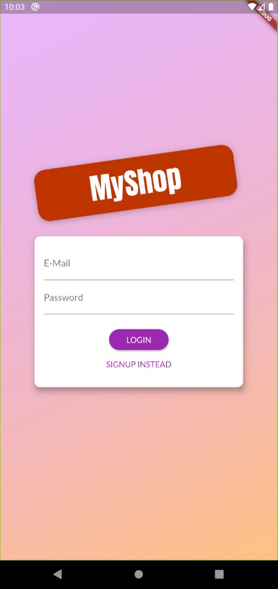
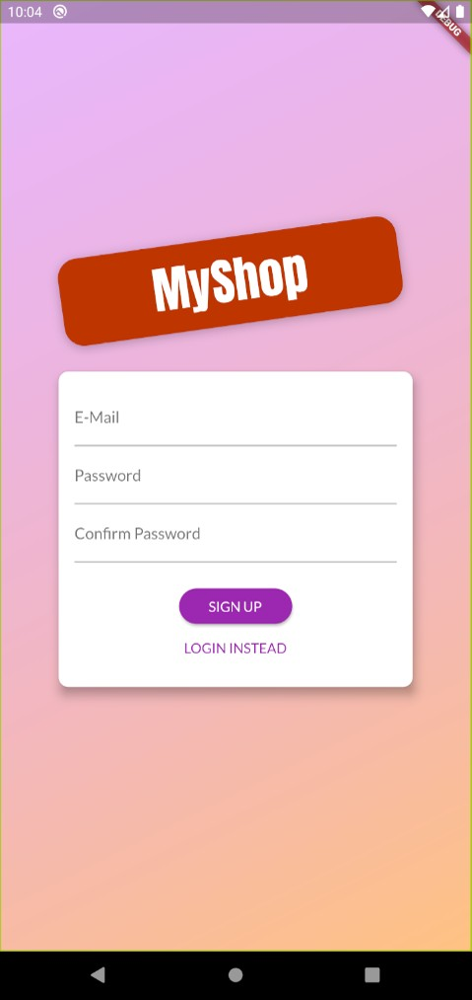
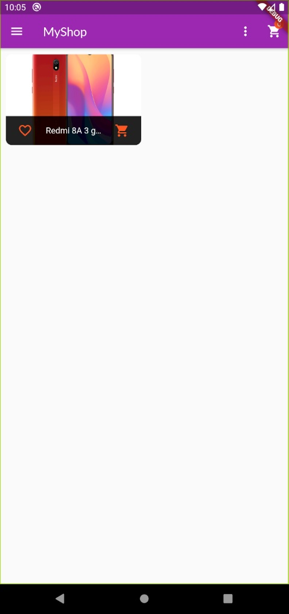
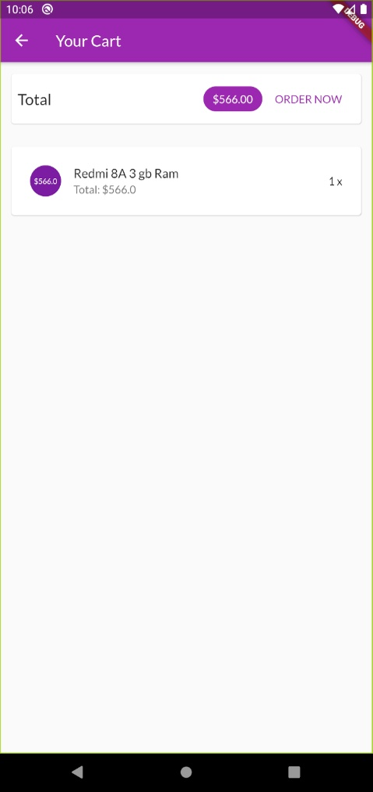
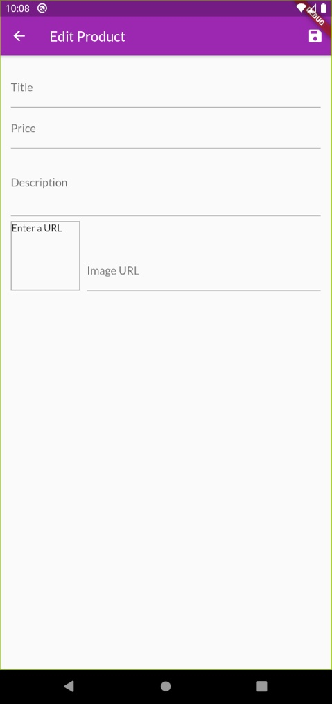
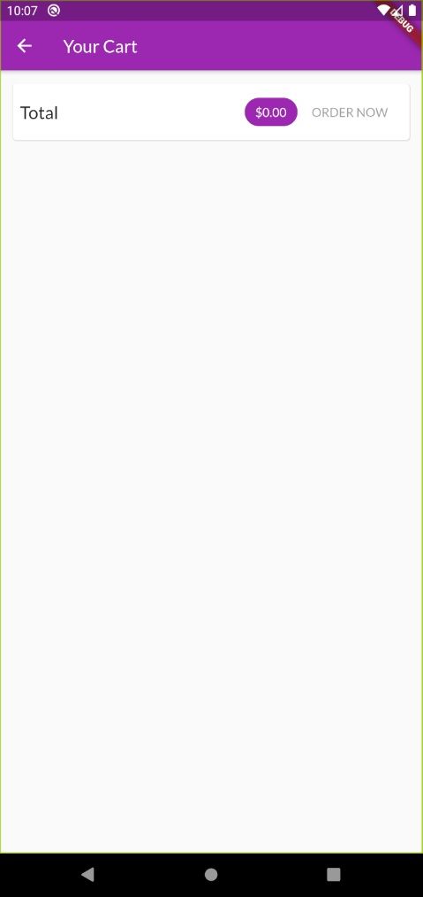
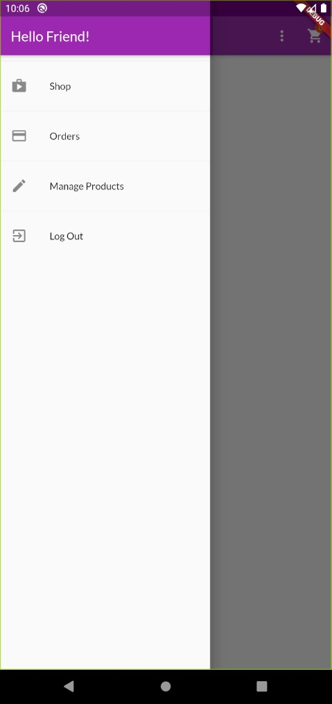

# Shop_app

Flutter App For Owner to upload products on main server using firebase auth and firebase services(Udemy - Maximilian)

Check my app here https://appetize.io/app/5088wf250mt4cumh97qrwx3954?device=nexus5&scale=75&orientation=portrait&osVersion=8.1

  
  

## Getting Started

This project is a starting point for a Flutter application.

A few resources to get you started if this is your first Flutter project:

- [Lab: Write your first Flutter app](https://flutter.dev/docs/get-started/codelab)
- [Cookbook: Useful Flutter samples](https://flutter.dev/docs/cookbook)

For help getting started with Flutter, view our
[online documentation](https://flutter.dev/docs), which offers tutorials,
samples, guidance on mobile development, and a full API reference.
